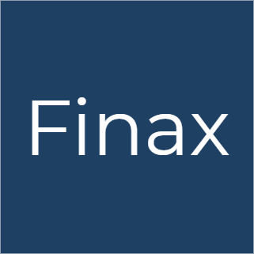

# Finance and billing app for desktops

## Stack:

1. Electron.js
2. Vue.js
3. NeDB

Build the app by running `npm run build`. This bundles the app in your current working directory and for the current platform you are in.

You can also provide a desired out path as the first argument and the platform as the second argument:

`npm run build C:\Users\current-user\Documents win64`
